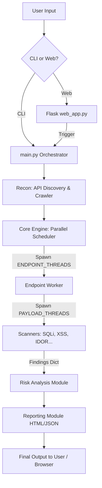

# WebSeeker Pro Architecture

## Overview
WebSeeker Pro is a fast, multi-threaded web vulnerability scanner designed to mimic advanced agentic security testing logic. 

## Core Architecture

The system is broken into the following key modules:

1. **`main.py` (CLI & Orchestrator)**
   - Entry point for the application.
   - Parses arguments, validates targets, and launches either the Web UI or the CLI scanner.
   - Triggers Endpoint Discovery and passes gathered URLs to the core engine.

2. **`core.engine` (The Scanner Engine)**
   - Manages the heavy lifting of the scanning process.
   - **Multi-Level Parallelism**:
     - The engine spins up a `ThreadPoolExecutor` bounded by `ENDPOINT_THREADS` to process multiple URLs at once.
     - Inside each endpoint worker, it spins up *another* `ThreadPoolExecutor` to run all vulnerability checks (SQLi, XSS, etc.) simultaneously for that specific endpoint.
   - Generates the unified finding list and passes it to the reporting module.

3. **`core.crawler` & `core.api_discovery` (Reconnaissance)**
   - Responsible for mapping the attack surface.
   - Uses a Breadth-First Search (BFS) multi-threaded crawler to map out the website's structure quickly.
   - Scrapes for API endpoints found in JavaScript files and common paths.

4. **`scanners/` (Vulnerability Modules)**
   - Independent modules responsible for detecting specific OWASP Top 10 vulnerabilities (e.g., `sql_injection.py`, `xss.py`).
   - Each module utilizes dynamic payload wordlists and executes them concurrently using `PAYLOAD_THREADS`.
   - Before executing payloads, heavyweight scanners call `utils.check_endpoint_alive()` to ensure the target is responsive.

5. **`web_app.py` (Dashboard)**
   - A Flask-based web interface for managing scans.
   - Uses Server-Sent Events (SSE) `/stream` to push real-time progress, ETAs, and logs to the browser dashboard asynchronously.

6. **`reporting/` (Generation)**
   - `html_generator.py`: Generates the interactive, dark-themed "Executive & Developer" HTML report.
   - Includes JSON and CSV exporters for integration into SIEMs/ticketing systems.

## Data Flow

